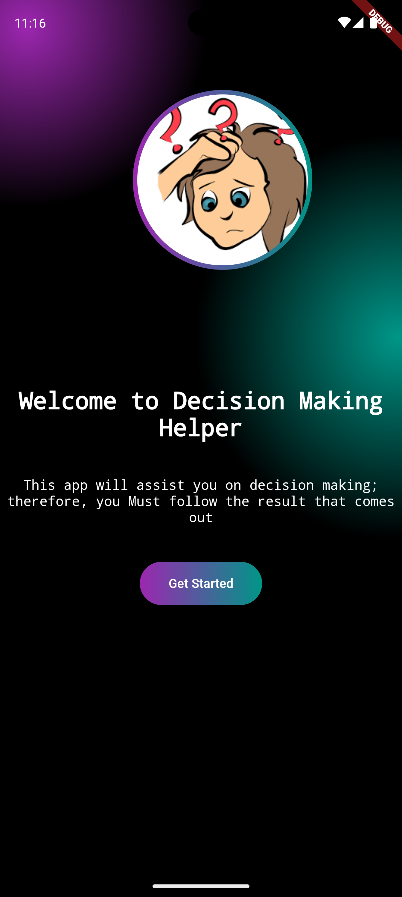

# Yes-No Generator

* A fun side project built on the Flutter framework.
* It involved API integration that generates a random answer between yes and no, along with the random meme gif associated with it.

## Quick View

  <picture> 
     &emsp; 
  </picture>
  <picture>
     &emsp;
  </picture>
  <picture>
    
  </picture>

## Getting Started

A few resources to get you started if this is your first Flutter project:

- [Lab: Write your first Flutter app](https://flutter.dev/docs/get-started/codelab)
- [Cookbook: Useful Flutter samples](https://flutter.dev/docs/cookbook)

For help getting started with Flutter, view our
[online documentation](https://flutter.dev/docs), which offers tutorials,
samples, guidance on mobile development, and a full API reference.
=======

