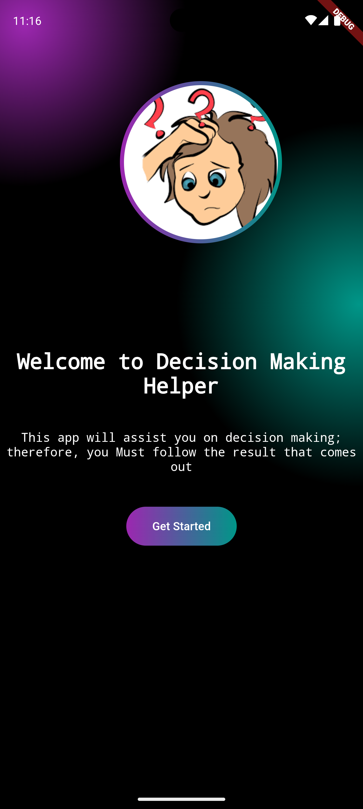

# 🎱 Yes-No Decision Helper


Can't make up your mind? Let the universe decide. Yes-No Decision Helper is a fun Flutter app that answers your yes/no questions with a random response and a matching meme GIF powered by a live API.

---

## Quick View

| Home | Yes | No |
|------|-----|----|
|  |  |  |

---

## Features

- Generates a random **Yes** or **No** answer at the tap of a button
- Fetches a matching **meme GIF** from a live API for each result
- Runs on **Android, iOS, Web, and Windows** from a single codebase
- Clean and minimal UI built with Flutter widgets

---

## Tech Stack

| Category   | Technology                          |
|------------|-------------------------------------|
| Framework  | [Flutter](https://flutter.dev)      |
| Language   | Dart                                |
| API        | [yesno.wtf API](https://yesno.wtf/api) |
| Platforms  | Android, iOS, Web, Windows          |

---

## Project Structure

```
Yes-No-Decision-Helper/
├── android/           # Android platform-specific files
├── ios/               # iOS platform-specific files
├── web/               # Web platform-specific files
├── windows/           # Windows platform-specific files
├── lib/               # Main Dart source code (app logic & UI)
├── assets/
│   └── images/        # Static images and preview GIFs
├── test/              # Widget and unit tests
├── pubspec.yaml       # Flutter dependencies and project config
└── pubspec.lock       # Locked dependency versions
```

---

## Prerequisites

- [Flutter SDK](https://docs.flutter.dev/get-started/install) (stable channel recommended)
- Dart SDK (included with Flutter)
- Android Studio, Xcode, or VS Code with the Flutter extension
- An active internet connection (the app fetches GIFs from the yesno.wtf API)

---

## Installation

1. **Clone the repository**
   ```bash
   git clone https://github.com/DyDyVNR/Yes-No-Decision-Helper.git
   cd Yes-No-Decision-Helper
   ```

2. **Install dependencies**
   ```bash
   flutter pub get
   ```

3. **Run the app**
   ```bash
   # Run on a connected device or emulator
   flutter run

   # Run specifically on web
   flutter run -d chrome

   # Run on Windows
   flutter run -d windows
   ```

---

## Usage

1. Launch the app on your device or emulator
2. Type your yes/no question (or just keep it in your head 🤔)
3. Tap the button to get your answer
4. Receive a definitive **Yes** or **No** — along with a GIF to seal the deal

---

## API

This app uses the [yesno.wtf API](https://yesno.wtf/api), a free public API that returns a random yes/no answer with an associated GIF.

**Example response:**
```json
{
  "answer": "yes",
  "forced": false,
  "image": "https://yesno.wtf/assets/yes/..."
}
```

---

## Contributing

This is a personal fun project, but feel free to fork it and make it your own!

1. Fork the repository
2. Create a feature branch (`git checkout -b feature/your-idea`)
3. Commit your changes (`git commit -m 'Add your idea'`)
4. Push to the branch (`git push origin feature/your-idea`)
5. Open a Pull Request

---

